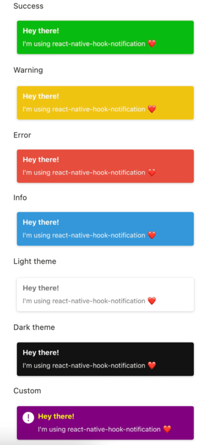

# React Native Hook Notification

Add notifications in your React Native app. Types: success, error, warning, info, default or custom.

- Compatible with `Reanimated v2`.
- Compatible with `Expo`.
- Written in `TypeScript`.



## Install

```shell
npm install react-native-hook-notification
```

or

```shell
yarn add react-native-hook-notification
```

#### Dependencies​

This library needs these dependencies to be installed in your project before you can use it:

```shell
npm install react-native-reanimated react-native-gesture-handler
```

or

```shell
yarn add react-native-reanimated react-native-gesture-handler
```

<br />

> **ℹ️ INFO**
>
> **React Native Gesture Handler** needs extra steps to finalize its installation, please follow their [installation instructions](https://github.com/software-mansion/react-native-gesture-handler).
>
> **React Native Reanimated v2** needs extra steps to finalize its installation, please follow their [installation instructions](https://docs.swmansion.com/react-native-reanimated/docs/fundamentals/installation/).

## Usage

- In the application index file:

```js
import React from 'react';
import { Component } from './component/Component';

export default function App() {
  return (
    <>
      <Component>
        <NotificationContainer />
      </Component>
    </>
  );
}
```

- In the component:

```js
import React from 'react';
import { TouchableOpacity, Text } from 'react-native';
import { useNotification } from 'react-native-hook-notification';

export default function Component() {
  const notification = useNotification();

  return (
    <TouchableOpacity
      onPress={() =>
        notification.success({
          text: 'Notification test',
        })
      }
    >
      <Text>Dispatch</Text>
    </TouchableOpacity>
  );
}
```

### Props

| Property        | Type                                                                                                                                                                                            | Required | Default   | Description                                                |
| --------------- | ----------------------------------------------------------------------------------------------------------------------------------------------------------------------------------------------- | -------- | --------- | ---------------------------------------------------------- |
| text            | string                                                                                                                                                                                          | yes      |           | Notification text                                          |
| title           | string                                                                                                                                                                                          | no       |           | Notification title                                         |
| position        | top-right \| top-center \| top-left \| bottom-right \| bottom-center \| bottom-left                                                                                                             | no       | top-right | Notification position                                      |
| theme           | colored \| light \| dark                                                                                                                                                                        | no       | colored   | Notification theme                                         |
| transition      | bounce \| flip \| fade \| slide \| zoom                                                                                                                                                         | no       | bounce    | Notification transition                                    |
| delay           | number                                                                                                                                                                                          | no       | 5000      | Notification delay in milliseconds                         |
| showButtonClose | boolean                                                                                                                                                                                         | no       | false     | Show or hide close button                                  |
| autoClose       | boolean                                                                                                                                                                                         | no       | true      | Automatic closing of the notification after the delay ends |
| pauseOnPress    | boolean                                                                                                                                                                                         | no       | true      | Auto close pause on hover                                  |
| draggable       | boolean                                                                                                                                                                                         | no       | true      | Enable or disable drag                                     |
| dragDirection   | x \| y                                                                                                                                                                                          | no       | y         | Drag direction                                             |
| icon            | React.FunctionComponentElement                                                                                                                                                                  | no       |           | Render icon on left side. Obs.: Dimensions: 24x24          |
| titleMaxLines   | number                                                                                                                                                                                          | no       | 1         | Maximum number of lines for title                          |
| textMaxLines    | number                                                                                                                                                                                          | no       | 2         | Maximum number of lines for text                           |
| customStyle     | `{ container?: StyleProp<ViewStyle>; title?: StyleProp<TextStyle>; text?: StyleProp<TextStyle>; icon?: StyleProp<ViewStyle>; button?: StyleProp<ViewStyle>;buttonText?: StyleProp<TextStyle>;}` | no       |           | Styles for custom notificaion type                         |

## License

[](https://opensource.org/licenses/MIT)

Developed by: [André Coelho](https://andrecoelho.dev)
